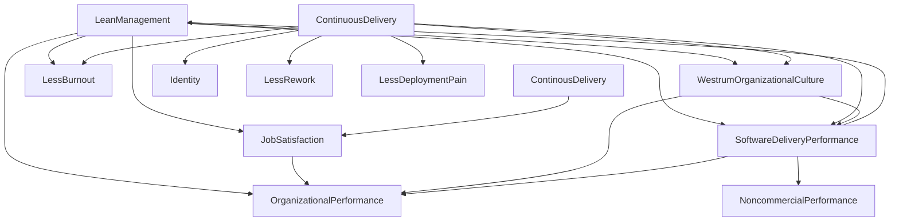
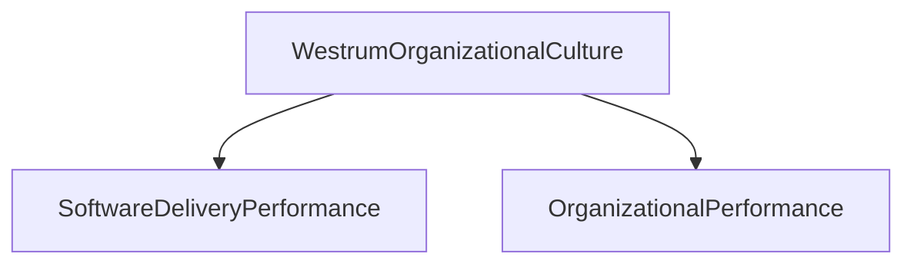

#personal #DevOps #business #books #NicoleForgren #JezHumble #GeneKim

The book provides insights and recommendations for creating and scaling high-performing technology teams based on data from over 30,000 professionals from technology organizations.

The key recommendations made in the book include:

1.  **Focus on culture and #leadership:** The authors argue that a strong culture and effective leadership are crucial for creating a team that is capable of delivering high-quality software quickly and efficiently. They recommend creating a culture that values #ContinuousImprovement, experimentation, and learning.

3.  **Invest in automation and testing:** The authors argue that automation and testing are critical for ensuring the quality of software and for reducing the time and effort required to deliver software. They recommend investing in test automation and continuous integration/continuous delivery #CI/CD practices.

4.  **Measure and provide feedback:** The authors argue that measurement and feedback are critical for understanding the performance of a team and for making data-driven decisions to improve performance. They recommend tracking metrics such as lead time, deployment frequency, and mean time to recovery #MTTR to measure performance.

5.  **Adopt DevOps practices:** The authors argue that DevOps is a key enabler of high-performing teams, as it allows teams to deliver software quickly and efficiently by breaking down silos between development and operations. They recommend adopting practices such as continuous delivery, infrastructure as code, and monitoring and observability.

The book also presents supporting metrics from its research, such as:

-   High-performing teams are able to deploy code up to 200 times more frequently than low-performing teams.
-   High-performing teams have lead times that are up to 46 times shorter than low-performing teams.
-   High-performing teams have MTTRs that are up to 168 times shorter than low-performing teams.

Overall, "Accelerate: Building and Scaling High Performing Technology Organizations" is a must-read for technology leaders looking for actionable insights and best practices for creating and scaling high-performing technology teams.

# Capabilities to Drive Improvement

There are 24 key capabilities that drive imporvement of software delivery performance. They are broken down into 5 categories:

1. Continuous Delivery #CD
2. Architecture
3. Product and Process
4. Lean Management and Monitoring
5. Culture

They also provided key metrics for leadership to measure performance:

1. **Delivery Lead Time** - Time it takes to go from customer making a request to that request being satisfied.
2. **Deployment Frequency** - Time between production deployment or "app store"
3. **Time to Restore Service** - Time to restore services from the time error is discovered to fix being deployed in production
4. **Change Fail Rate** - Percentage of changes that result in degraded service or subsequently require remediation (i.e lead to service impariment or outage, require hotfix, a rollback, a fix-forward, or a patch)

## Continuous Delivery

### Version Control
### Deployment Automation
### Continuous Integration #CI 
### Trunk-based Development
### Test Automation
### Test Data Management
### Shift Left on Security
### Continuous Delivery (CD)

## Architecture

### Loosly coupled architecture
### Empowered Teams

## Product and Process Capabilities

### Customer Feedback
### Value Stream
### Working in Small Batches
### Team Experimentation

## Lean Management and Monitoring Capabilities

### Change Approval Process
### Monitoring
### Proactive Notification
### WIP Limits
### Visualizing Work

## Cultural Capabilities

### Westrum Oranizational Culture (1988)
There are 3 main categories of #WestrumOraganizationalCulture: 

- #Pathological (power-oriented)
	- Characterized by large amounts of fear and threat. People often hoard information or withhold it for political reasons, or distort it to make themselves look better.
- #Bureaucratic (rule-oriented)
	- Protect departments. Those in the department want to maintain their "turf", insist on their own rules, and generally do things by the book - *their* book
- #Generative (performance-oriented)
	- Focus on the mission. How do we accomplish our goal? Everything is subordinated to good performance, to doing what we are supposed to do. 

Further insight was that culture predicts informatuion flow. This flow is vital to the safe and effective operations of high-tempo and high-consequence environments.

| Pathological                  | Bureaucratic              | Generative               |
| ----------------------------- | ------------------------- | ------------------------ |
| Low cooperation               | Modest cooperation        | High cooperation         |
| Messageners "shot"            | Messangers Neglected      | Messengers Trained       |
| Responsibilities Shirked      | Narrow Responsibilities   | Risks are Shared         |
| Bridging Discouraged          | Bridging Tolerated        | Bridging encouraged      |
| Failure leads to scapegoating | Failure leads to justice  | Failure leads to inquiry |
| Novelty Crushed               | Novelty leads to problems | Novelty implemented      |

** Note: Bureaucratic isnt bad. The goal is to "ensure fairness by applying trules to administrative behavior". The fault is when the rules become more important than the mission.

### Supporting Learning
### Collaboration Amoung Teams
### Job Satisfaction
### Transformational Leadership